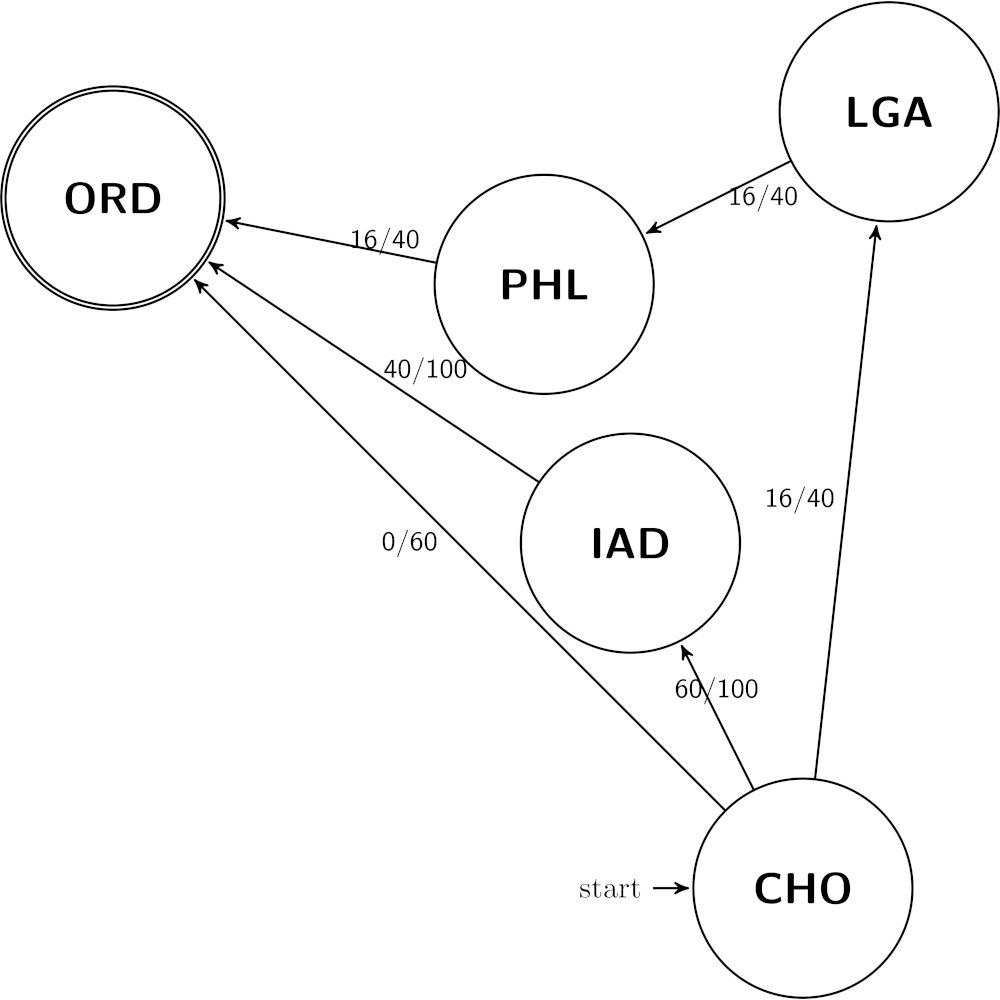

# Programming Assignment 1: Aircraft Loading


### Rules on Collaboration and Outside Sources

You must follow the rules about Collaboration and Outside Sources [in the syllabus](https://uva-cs.github.io/dsa2/syllabus.html#honesty-collaboration-and-generative-ai-usage).  For all programming assignments, you are not allowed to use generative AI tools to help you solve this problem.  You may use it to look up small chunks, as if you were using a manual (2 lines max per use).


### Description

After graduating UVA, you start to work for cargo airline company -- your job is to help route the packages to their destination.  This company already has regular daily flights that are moving between the various cities carrying their overnight packages.  Your task is to determine how to fill the remaining capacity in the aircraft with packages that were shipped using a slower (non-overnight) delivery method.

Your algorithm will be given a graph consisting of airports (vertices) and the already-scheduled flights between them (edges).  Each edge will have an available capacity *a* and a total capacity *t*.  We can then compute the *load* of the edge as *l = t - a*; that is, how much cargo is *already* on the plane. Additionally, we can compute the *load percentage* by calculating *p = l / t*.

Your goal will be to write an algorithm which finds the path from a given start airport to a destination airport which *minimizes the sum of load percentages* across the edges used.  Note that the number of flights used is irrelevant for this assignment, as aircraft are already flying between the cities, we are simply using available capacity, and we do not care about how many days it will take for this package.  We only care to *minimize the sum of load percentages*. At-capacity flights may not be used, since that aircraft cannot handle any more cargo.

Specifically, for a given path from the start airport to the destination, the *p* values for each edge are summed, and we are looking for the lowest sum of load capacities for all available paths.  An example of this computation is provided in the Example section below.

For this assignment, we will assume that all packages weigh the same amount (1 unit), and the capacities of the aircraft use that same unit.

### Changelog

Any changes to this page will be put here for easy reference.  Typo fixes and minor clarifications are not listed here.  So far there are no significant changes to report.


### Example



Let's imagine that you wanted to ship cargo from Charlottesville (CHO) to Chicago (ORD).  Consider the graph to the right.  The start is at node CHO, and the end is at node ORD.  Each edge is labeled with the available capacity (before the slash) and the total capacity (after the slash).


In this example, there are three paths from the start node to the end node.  The correct path your algorithm should return would be CHO&rarr;IAD&rarr;ORD. 

- The edge CHO&rarr;ORD is at capacity (has 0 available space), with a load percentage of 100%, so it cannot be used.
- The path CHO&rarr;LGA&rarr;PHL&rarr;ORD has available capacity 16/40 (40%) on each of the three segments, which means each segment has is loaded at 24/40, or 60%.  The sum of these is 180%.
- The path CHO&rarr;IAD&rarr;ORD has available capacity 60/100 (60% available, 40% loaded) for the path from CHO&rarr;IAD, and 40/100 (40% available, 60% loaded) for the path from IAD&rarr;ORD.  This sums to 100%.

As the third path *minimizes the sum of load percentages*, it would be the output path.

The actual output would be:

```
CHO
IAD
ORD
```

For another example, consider if we made one graph change: changing the available capacity of the CHO&rarr;ORD edge to 60 (which means 40% loaded).  In this new example, then the output would be:

```
CHO
ORD
```


<br clear='all'>


### Input

The first line of the input will contain three values: the number of edges (`num_edges`, a positive integer), the starting node (a string), and the ending node (another string).

The next `num_edges` lines will contain information on the edges; node names are derived from these lines as well.  Each line will have four space-separated values: starting node (a string), ending node (another string), available capacity (a non-negative integer) and total capacity (a non-negative integer).  

All string node names will be a series alphanumeric characters in upper-case, no longer than 20 characters each.  All integers will be non-negative, and will fit into a 32-bit signed `int` variable.  All values on a given line will be separated by a single space

You may always assume that the provided input is in a valid format.  You can also assume that there is at least one available path from the start to the finish.

There will only be one test case per file.

The provided skeleton code, below, already reads in the input from the standard input.

### Output

Your output will be a list of airports which starts at the start airport and ends at the destination airport, that also *minimizes the sum of load percentages*.  The main method provided will print this list one airport per line.  An example output is given below.

All output must be printed to standard output.


### Example Input

This input corresponds to the graph shown above.  This is available in the [example.in](files/pa1-example.in) file.

```
6 CHO ORD
CHO LGA 16 40
CHO IAD 60 100
CHO ORD 0 60
IAD ORD 40 100
LGA PHL 16 40
PHL ORD 16 40
```


### Example Output

This input corresponds to the graph shown above.  This is available in the [example.out](files/pa1-example.out) file.

```
CHO
IAD
ORD
```

### Submission Requirements

- The worst-case asymptotic running time of your program should belong to *O(ve)*, where *v* is the number of airports and *e* is the number of airways.
- Your algorithm must be work in one of: Python (version 3.10.12), Java (OpenJDK version 25.0.4), C (gcc version 11.4.0), C++ (g++ version 11.4.0), or Rust (version 1.75.0)
    - The file MUST be named pa1.py, PA1.java, pa1.c, pa1.cpp, or pa1.rs, depending on what language you are implementing it in.
- We are providing skeleton code in Python ([pa1.py](files/pa1.py.html) ([src](files/pa1.py))) and Java ([PA1.java](files/PA1.java.html) ([src](files/PA1.java)))
- Your code will be run as: 
    - `python3 pa1.py < example.in` for Python
    - `java PA1 < example.in` for Java
    - `./a.out < example.in` for C, C++, and Rust
- Any and all source code must be in the one file that you submit
- You may **not** use any graph packages for this assignment.
- Please note that you are responsible for analyzing the running time of any algorithm you use and ensuring that they satisfy the runtime requirements for this assignment.

You will submit your completed source code file to Gradescope.  There will be a *small set* of acceptance tests that are ***NOT COMPREHENSIVE***.  These acceptance tests are the test cases in the [example.in](files/pa1-example.in) file.  It's up to you to comprehensively test your code.  The acceptance tests just verify that you are reading the input correctly and providing the expected output.

Note that when you submit, Gradescope will report your grade as "-/10" or "0/10" -- that's a quirk of Gradescope, and is because the grading tests have not been run (and won't be run until after all submissions are in).  YOu can look at the results of the individual test cases to see how your program worked
