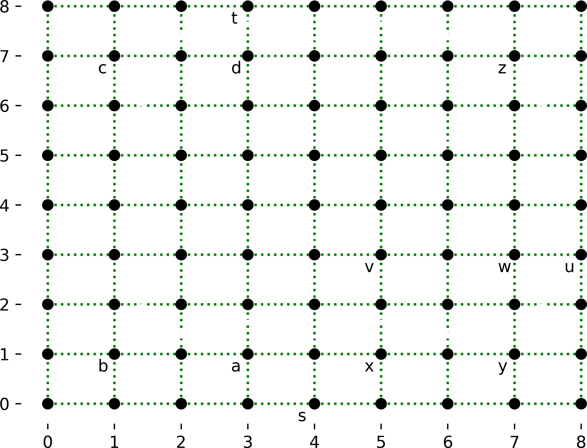
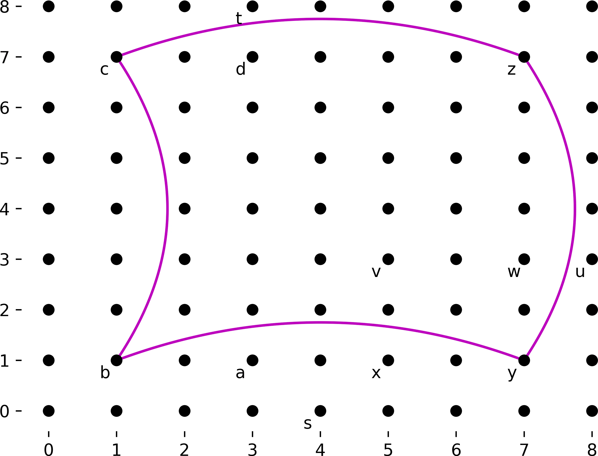

Given a graph with the edge weights representing distance, Dijkstra's shorted path algorithm will always find the shortest path.  However, this may not be the *fastest* path if one's speed over each edge can vary.  And it's not going to be very quick for an extremely large graph.  This assignment will examine an adaptation of Dijkstra's that chooses a path that uses more of the faster roads (highways) over the slower roads (side roads).

This homework builds upon the material taught in lecture on slides 86-89 of the graphs slide set.  You will need to be familiar with that material -- both through the slide set and the video recordings -- in order to proceed with this homework.

### Changelog

- Feb 3: added an Execution section at the bottom

### Example


Consider the weighted graph image to the right.  The green dotted lines are the side roads; there is a side road between every set of orthogonally adjacent nodes in that diagram.  Main roads -- red dashed lines in the figure -- connect every set of nodes that are distance 2 apart.  Highways, shown as solid purple lines, connect every set of nodes that are distance 6 apart.  In this graph, the weight of an edge is just the distance between the nodes.  ***HOWEVER this isn't always true.***  The graph has weights provided for each edge.

Let's assume that one was driving from (4,0), labeled $s$, to node (3,8), labeled $t$.  The process would be:

- Take side roads to the nearest main road (the edge from $s$ to $a$), for distance 2; note that this could have gone to node $x$ as well, since that is equivalent distance
- Take main roads to the nearest highway (the edge from $a$ to $b$), for distance 2
- Take highways to get close to the destination (the edges from $b$ to $c$); one can go either way on this graph (through $y$ or through $z$), for distance 6
- Take main roads to get close to the destination (the edge from 'c' to 'd'), for distance 2
- Take side roads to get to the destination (the edge from 'd' to 't'), for distance 1

The total distance using this algorithm is 13, whereas straight Dijkstra's algorithm has a distance of 9.  Presumably, if this were a real road map, the time spent on the side roads of lower speed would mean that, while it's a shorter distance, it would take longer to get there.  The path taken would be: (4,0) -> (4,1) -> (3,1) -> (1,1) -> (1,7) -> (3,7) -> (3,8).  A path that went through $x$ instead of $a$ would also be correct.

That image is really showing three different graphs overlaid on each other, that of side roads, main roads, and highways, respectively:

<br clear='all'>






The starting node may already be a node that connects a highway.  In this case, you would skip the necessary steps.  For example, if the start node in the above diagram was $y$ (at (7,1)), and the end node was $d$ (at (3,7)), it would proceed as follows:

- Side roads to main road: not necessary, as we are on a node that connects main roads
- Main roads to highways: not necessary, as we are on a node that connects highways
- Highways to get close to destination: takes the edge from $y$ to $c$ (going through either $b$ or $z$)
- Main roads to get closer to the destination: takes the edge from $c$ to $d$
- Side roads to destination: not necessary, as we are at our destination

The path taken would be: (7,1) -> (1,7) -> (3,7), with distance 14.

Similarly, if you are traveling from $x$ (5,1) to $u$ (8,3), you would skip many of the steps:

- Side roads to main road: not necessary, as we are on a node that connects main roads
- Main roads to highways: this takes the edge from $x$ to $y$
- Highways to get close to destination: there are no highway intersection nodes closer to our destination than where we are
- Main roads to get closer to the destination: this takes the edge from $y$ to $w$
- Side roads to destination: takes the edge from $w$ to $u$

The path taken would be: (5,1) -> (7,1) -> (7,3) -> (8,3), with distance 5.

We are not looking for an optimal path.  Instead, we are looking for a path that follows these five steps, as that can be computed far faster.

### Input

**Note: for this homework, we are providing you with skeleton code that handles reading in of the input.  HOWEVER, this will not be provided in future homeworks, so you should ensure that you understand how it works.**

All input is read in from standard input (not a file).

Each run of the program will have only one graph, but will have multiple test cases.

The first line of the input will contain three integers: $s$, $m$, and $h$, which are the number of side road edges, main road edges, and highway edges, respectively.

The next line will contain $s$ side road edges.  Each edge is a 5-tuple: $(x_1,y_1,x_2,y_2,w)$, where $(x_1,y_1)$ is the starting coordinate of the edge, $(x_2,y_2)$ is the ending coordinate, and $w$ is the weight (cost) of traversing that edge.  All edges in this assignment are bi-directional.  As before, these values are all on one line, so consecutive sets of five integers form one edge.

The next line will contain $m$ main road edges.  These are formatted the same as with the side roads.  All edges in this assignment are bi-directional.

The next line will contain $h$ highway edges. These are formatted the same as with the side roads.  All edges in this assignment are bi-directional.

Note that the nodes themselves can be determined from the edges.

The next line will contain an integer $n$, the number of test cases to run on this map.

Each test case will consist of a single line of four values, space separated: $(x_1,y_1,x_2,y_2)$, where $(x_1,y_1)$ is the starting coordinate, and $(x_2,y_2)$ is the ending coordinate.

### Output

There are $n$ test cases in each input file.  The output for each test case will consist of two lines.  The first line contains a single integer, which is the distance of the computed path.  The second line contains a single integer, $l$, which is the length of the path (including both the start node and end node).  The next $l$ lines contain the coordinates of the nodes in the path, space separated (no parenthesis or commas).

There is a blank line between test case outputs.

The skeleton code provides output routines.

### Example input

This file is available as [example.in](example.in), and corresponds to the diagram shown above.  The two test cases in this input are also the examples given above.

Note that the example input below has the data truncated to make it fit in this assignment; the full version is in [example.in](example.in).

```
144 24 4
0 0 0 1 1 0 0 1 0 1 0 1 0 2 1 0 1 1 1 1 ...
1 1 1 3 2 1 1 3 1 2 1 3 1 5 2 1 3 3 3 2 ...
1 1 1 7 6 1 1 7 1 6 1 7 7 7 6 7 1 7 7 6
3
4 0 3 8
1 1 3 7
5 1 8 3
```

### Example output

This output is contained in the [example.out](example.out) file.

```
13
7
4 0
3 0
3 1
1 1
1 7
3 7
3 8

8
3
1 1
1 7
3 7

5
4
5 1
7 1
7 3
8 3
```

### Data Structure Requirements

Your code must use a min-heap (aka a priority queue).

- Python users should use [heapq](https://docs.python.org/3/library/heapq.html) -- you can pass in a 2-tuple that contains the priority (distance) and the node.  The second example on that page shows this.
- Java users should use the [java.util.PriorityQueue class](https://docs.oracle.com/javase/8/docs/api/java/util/PriorityQueue.html).

You should first get it working without a priority queue, as that will be simpler to program and debug (and you can still get partial credit that way).  Once it's working, add in the priority queue.

Neither of the two suggested priority queues -- [Python's heapq](https://docs.python.org/3/library/heapq.html) and the [java.util.PriorityQueue class](https://docs.oracle.com/javase/8/docs/api/java/util/PriorityQueue.html) -- have the `decreaseKey()` method.  Instead, you can use the solution shown in the Python pseudo-code in the slides (graphs slide #79), which has three parts:

- Only add the nodes to the priority queue when it has a finite distance
- If the distance is lowered, add the node to the priority queue again (with the shorter distance) -- this means you may have the same node in the priority queue multiple times
- Have a means to check if a node has already been handled ("done" in the slides) to handle the fact that a single node may appear multiple times in the priority queue


### How to start

We provide skeleton code that correctly reads in the input: [pa1.py](pa1.py.html) ([src](pa1.py)) and [PA1.java](PA1.java.html) ([src](PA1.java)).

- First, figure out how you want to represent the graph, either an adjacency matrix or an adjacency list -- either one is fine.  Implement that for the three different graphs (side roads, main roads, and highways)
	- Recall that the edges are bi-directional, but only given in one order in the input
- TEST YOUR REPRESENTATION!  If it's not fully working, you are never going to succeed on the next steps
- Next, implement Dijkstra's shortest path algorithm.  If you do not get the full version working, you can still get partial credit for being able to run Dijkstra's algorithm on the entire graph.
  - You may want to have your first implementation not use heaps, and then add heaps once you know it's working (backup the version before you start making these types of modifications)
	- You may want to first implement Dijkstra's with a simple data structure (arrays or lists) before adding in a priority queue.
- Next, implement each of the five stages, but one at a time.  Implement the first stage (side roads to main road intersection), then run Dijkstra's to the final destination.  Each stage is a slight modification of Dijkstra's, which was written in the previous step.
- Each phase is a bit different:
	1. Side roads from start node to main roads: you run Dijkstra's on the entire graph until the node you are at (meaning the one that becomes "known") connects to a main road edge (which may be where you start)
	2. Main roads to highways: again, run Dijkstra's on the main roads graph until you the node you are at connects to a highway edge (which, again, may be where you are at before you start this stage)
	3. Highways to destination: this stage is done *last*
	4. Side roads from destination node to main roads: as above (step 1), but we are working backward from our destination
	5. Main roads from near out destination node to highways: again, as above (step 2)
	6. Highways: you have two highway nodes from steps 2 and 5.  Run Dijkstra's on the highway graph to connect the two nodes.


### Notes

There are some assumptions that you may and may not make:

- You can assume that the input read in is valid (correct format, etc.)
- You can assume there will always be a path from the start to the destination in the provided graph, following the examples given here.  You will not, for example, get a graph where the highway nodes nearest the source do not connect to the highways nearest the destination.
- There will never be more than one edge between any two nodes.
- No path length will be greater than $10^6$
- When determining your running time, you can (and should) ignore the setup in the code we provide

### Execution

We will run your program as follows:

```
cat example.in | python pa1.py
```

This takes the output of what is on the left (`cat example.in`, whose output is the contents of example.in) and uses it as the input to what is on the right.  This version should work in all platforms (Windows, MacOS, and Linux).

### Submission

You will submit your completed `pa1.py` or `PA1.java` to Gradescope.  There will be a *small set* of acceptance tests that are *NOT COMPREHENSIVE*.  It's up to you to comprehensively test your code.  The acceptance tests just verify that you are reading the input correctly and providing the expected output.

