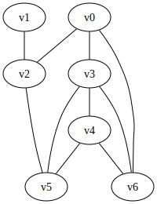
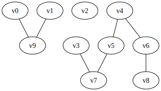

<a href="https://upload.wikimedia.org/wikipedia/commons/3/3f/Internet_map_1024_-_transparent%2C_inverted.png"></a>

When you send data over the Internet, that data, which is split into *packets*, has to be sent over a given *route* to the destination.  That route is through a graph, where the nodes are routers, and the edges are wires (or fiber optic cables, or WiFi) between routers.  This is the *routing* of the Internet, and the real-world algorithms are very much like breadth first search (BFS).

The task in this assignment is to implement a form of Internet routing that only uses BFS.  A graph of the network will be provided, and a series of *queries* will be asked -- each query will be a pair of nodes (source and destination).  The answer to the query is the distance to the destination, and the first node to send it to on the path toward that destination.

So far, this is normal BFS.  However, there may be a *lot* of queries asked.  The program will not have time to run BFS multiple times from the same source node -- so once it is run for a given node, you will have to save those results.  This mirrors how the Internet works -- routers keep track of known routing info in *routing tables*, and do not re-run BFS for each packet it needs to send on to its destination.


### Input

An input file will start with a line containing a single integer $1 \le t \le 10^5$, which is the number of test cases in the file.

The first line of each test case will have three integers, all space separated: $n$, $e$, and $q$, where $n$ is the number of nodes, $e$ is the number of edges, and $q$ is the number of queries.  These values will all fit into a 32-bit signed integer (i.e., between 1 and $2^{31}-1$, or between 1 and 2.14 billion).

The next line will have *all* of the edges as pairs of nodes, all on one line, space separated.  Thus, if there are $e$ edges, there will be $2e$ strings on that line, all space separated.  They are in pairs, so the first two constitute an edge, as do the third and fourth, etc.  Note that all edges are bi-directional.  No edge will appear twice, and no edge and its reverse edge will not appear (i.e., if "s d" is present, then "d s" will not be present).  All nodes will be named "vXXX" where XXX will be consecutive integers starting from 0.

Following this will be the $q$ queries, all on one line, space separated.  This, if there are 10 queries, there will be 20 strings on that line, and each successive pair will be a source/destination pair for that query.

The input provided will always follow these rules -- you do not need to do any checks on the input.

### Output

Each query should output four values on a single line, space separated.  Those values are: 

- The source node, provided in the query line in the input
- The destination node, provided in the query line in the input
- The distance, as an integer
- The next hop *from the source* to get to the destination

If there are multiple minimum length paths from the source to the destination, then any possible next hop of these minimum paths is acceptable.

If there are no paths, then "None" (case insensitive) should be output for *both* the distance and the path.

There should be a blank line between test cases.  An extra blank line at the end of the file is acceptable.


### Sample Input

This input is available as [example.in](example.in).  The first test case has 7 nodes, 10 edges, and 10 queries, and is a full connected graph.  The second test case has 10 nodes, 7 edges, and 10 queries, and is not a connected graph.

```
2
7 10 10
v1 v2 v0 v3 v4 v6 v3 v6 v3 v4 v4 v5 v0 v6 v3 v5 v0 v2 v2 v5
v1 v0 v3 v5 v1 v5 v0 v2 v6 v1 v0 v3 v4 v3 v3 v6 v2 v0 v5 v0
10 7 10
v5 v7 v3 v7 v1 v9 v6 v8 v0 v9 v4 v6 v4 v5
v1 v5 v8 v5 v3 v9 v4 v2 v1 v3 v2 v4 v5 v6 v8 v3 v1 v9 v3 v2
```

This input corresponds to the following two graphs:

{style="border:1px solid black;border-radius:10px"}
{style="border:1px solid black;border-radius:10px"}

For the second graph, note that at least one of the queries ("v2 v4") is from a node that has no adjacent edges.  Other queries, such as "v1 v5" do not have a path between them.


### Sample Output

This output is available as [example.out](example.out).


```
v1 v0 2 v2
v3 v5 1 v5
v1 v5 2 v2
v0 v2 1 v2
v6 v1 3 v0
v0 v3 1 v3
v4 v3 1 v3
v3 v6 1 v6
v2 v0 1 v0
v5 v0 2 v3

v1 v5 None None
v8 v5 3 v6
v3 v9 None None
v4 v2 None None
v1 v3 None None
v2 v4 None None
v5 v6 2 v4
v8 v3 5 v6
v1 v9 1 v9
v3 v2 None None
```

### Hints

We are providing skeleton code to read in the input.  The code is [pa1.py](pa1.py.html) ([src](pa1.py)) and [PA1.java](PA1.java.html) ([src](PA1.java)).

We also have additional test cases to use:

- [example3.in](example3.in) has 10 edges, 20 nodes, and 30 queries, and the output is in [example3.out](example3.out); an image of the graph can be seen [here](example3.svg)
- [example4.in](example4.in) has 200 edges, 400 nodes, and 1000 queries, and the output is in [example4.out](example4.out); an image of the graph can be seen [here](example4.svg), but that image won't be of much use due to its complexity

Those files are examples 3 and 4 because examples 1 and 2 were provided in the [example.in](example.in) and [example.out](example.out) file, above.

**How to start:** First, make sure you can read in the graph correctly.  Then implement your graph representation. Test this!  You can print it out and verify it matches the graph images above.  If your graph representation does not work correctly, nothing else will work, and you will just frustrate yourself trying to debug it.  Once you know it works correctly, implement BFS as per the formal algorithm in the slides.  Test this as well!  Then, and only then, implement the full set of requirements where you run BFS for each query.  That will work, but it will be slow.  Lastly, have a means to save the BFS results so you don't have to run it again the second time you have the same starting node.  Note that *some* test cases will not need to save the prior runs of BFS for a given node, but other test cases will need to do this.  So you can get partial credit without this last feature, but you will need it for full credit.

### Submission

The submission system can handle four different programming languages, although only two have skeleton code provided (Python and Java).  For each programming language, the name of the submitted file is listed below -- you have to have it named that exact name, else it will not compile properly.  If you want to program in a different language, email the course email at least three days before it is due, as we have to reconfigure the submission system to handle that language.

- Python 3: pa1.py
- Java: PA1.java
- C: pa1.c
- C++: pa1.cpp

You will submit your completed source code file to Gradescope.  There will be a *small set* of acceptance tests that are ***NOT COMPREHENSIVE***.  These acceptance tests are the test cases in the [example.in](example.in) file.  It's up to you to comprehensively test your code.  The acceptance tests just verify that you are reading the input correctly and providing the expected output.

Note that when you submit, Gradescope will report your grade as "-/10" or "0/10" -- that's a quirk of Gradescope, and is because the grading tests have not been run (and won't be run until after all submissions are in).  YOu can look at the results of the individual test cases to see how your program worked
