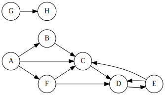
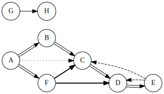

### Reminder: Policy Regarding GenAI

This is a friendly reminder on the class policy regarding the use of GenAI on programming assignments in this course. While you may use GenAI to **do the equivalent of looking up known information on the web / in a manual**, you may **NOT use GenAI to generate the solution to any part of this programming assignment**. The purpose of the assignment is to practice your problem solving and programming implementation skills on your own. If we find that you have copied significant code generated by AI for this programming assignment, this will be considered an honor violation.


### Introduction

You are hired by the Disease Suppression Agency (DSA) to do contact tracing for a recent outbreak of Monday-itis.  This is a serious disease!  It apparently is quite infectious from one person to another.

The DSA folks have provided you with a list of contacts that people with Monday-itis have had, helping to indicate who transmitted it to whom. To help sort out the ordering, you have to write a program to determine the total pathogen load on a given individual in the contact trace.

Apparently there are multiple ways a person can come into contact with the Monday-itis pathogen (note that contacts are in a specific single direction only):

- First contact: this provides the largest pathogen load to the newly infected individual, and is when the infection starts. (tree edge)
- Forward contact: this is when, for example, person A infects person B, person B infects person C, and then person A comes into contact with person C.  This, also, causes a lower pathogen load. (forward edge)
- Looped contact: this is when, for example, person A infects person B, then person B infects person C, and then person C comes into contact with person A.  Since it is the same strain that person A had originally, the pathogen load is not as strong.  (back edge)
- Cross contact: this is when a person comes into contact with somebody that is not in their infection hierarchy at all.  (cross edge)

These types of contacts can be represented as the edges of a depth-first search -- the edge types are listed in the list above.  Each type of contact provides a different (integer) pathogen load to the individual.  The amount of those pathogen loads are provided in each test case.

We will assume, for simplicity sake, that the DFS always proceeds in alphabetical order of the possible adjacent nodes.

### Example

Consider the following contacts trace graph:



If we run DFS on it, starting at A, we get the following result.  In the graph below, double edges are tree edges, dotted are forward edges, dashed are back edges, and bold edges are cross edges.  Regular edges (the one from G to H) were not encountered in the DFS, which started at node A.  Recall that when in a given node, we always process the outgoing edges alphabetically.




Assume that the pathogen load for each type of contact is $(10,5,3,4)$ -- this means 10 for an incoming tree edge, 5 for an incoming forward edge, 3 for an incoming back edge, and 4 for an incoming cross edge.  The various nodes would have the following pathogen load:

- Node A: 0 (no incoming edges)
- Node B: 10 (one incoming tree edge)
- Node C: 22 (one of each type of incoming edge)
- Node D: 17 (one incoming tree edge, one incoming cross edge, and one incoming back edge)
- Node E: 10 (one incoming tree edge)
- Node F: 10 (one incoming tree edge)
- Node G: 0 (no incoming edges at all)
- Node H: 0 (no incoming edges found in the DFS)

If there is a node to which there is no path from the start node, such as nodes G and H in the graph above, then the answer is 0 (these were people that were not infected).

### Input description

The first line of the input file will contain the total number of test cases $c$ in the file, where $1 \le c \le 10^5$.

Each test case will have exactly four lines:

- The first line will list the values for the pathogen load for each type of incoming edge, in the order: tree, forward, back, cross.  These values will be positive integers $1 \le w_t,w_f,w_b,w_c \le 10^6$.
- The second line will list the number of vertices $2 \le v \le 10^9$, and the number of edges $1 \le e \le 10^{15}$.  
	- NOTE: the value for $e$ can exceed the maximum size of a typical `int`, so use a `long` (if appropriate for your programming language).
- The next line will contain all of the edges in the graph.  Each edge will contain a space separated pair of node names.  Each pair will also be separated by a space.  Thus, there will be $2v$ strings on this line.
	- All node names are alpha-numeric strings of length $1 \le l \le 32$.
- The last line will contain two nodes: the first, $s$, is the start node (aka patient zero), and the second is the node for which the pathogen load will be output.

### Output description

For each test case, the (single) integer pathogen load of the designated node should be output.  Any given output value may exceed the size of an `int`, but will fit into a `long`.

### Sample input

The input below, for all four test cases, corresponds to the graph above.  The only difference is the node to print the pathogen load for -- it is nodes C, D, F, and H, respectively.  This input is provided in the [example.in](example.in) file.

```
4
10 5 3 4
8 11
A B B C C D D E A C A F E C E D F C F D G H
A C
10 5 3 4
8 11
A B B C C D D E A C A F E C E D F C F D G H
A D
10 5 3 4
8 11
A B B C C D D E A C A F E C E D F C F D G H
A F
10 5 3 4
8 11
A B B C C D D E A C A F E C E D F C F D G H
A H
```

### Sample output

```
22
17
10
0
```

### Skeleton Code

We are providing skeleton code for this assignment.  You should start with [pa1.py](pa1.py.html) or [PA1.java](PA1.java.html).  This code reads in the input described above.

### Implementation notes

- When you submit your code, the test case shown above will be run to ensure your program is handling the input and output correctly.
- You should ***NOT*** represent your graph as an adjacency matrix, as there will not be enough memory for some of the graphs that we will provide for testing.
- Some of the values above will require a `long` type for some programming languages (C, C++, Java, etc.).  Other languages (Python) will not need to worry about this.
- You need to implement DFS yourself -- you cannot use a library function for DFS.
- We will never provide you with invalid input, so you do not need to error check the input values provided.
- Although you are not graded on the speed of your program's execution, it has to run in the expected DFS running time of $\Theta(V+E)$, else it will time out with some of the larger test cases.

### Submission

The submission system can handle four different programming languages, although only two have skeleton code provided (Python and Java).  For each programming language, the name of the submitted file is listed below (you have to have it named that exact name, else it will not compile properly).  If you want to program in a different language, email the course email at least three days before it is due (as we have to reconfigure the autograder).

- Python 3: pa1.py
- Java: PA1.java
- C: pa1.c
- C++: pa1.cpp

You will submit your completed source code file to Gradescope.  There will be a *small set* of acceptance tests that are ***NOT COMPREHENSIVE***.  These acceptance tests are the test cases in the [example.in](example.in) file.  It's up to you to comprehensively test your code.  The acceptance tests just verify that you are reading the input correctly and providing the expected output.
