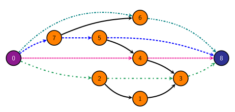
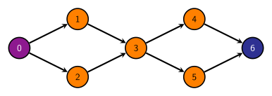

<figure style="float:right;width:40%;margin-left:20px">
<a href="../../slides/graphs/reductions/edge_disjoint_graph.svg"></a>
<a href="../../slides/graphs/reductions/edge_disjoint_graph-2.svg"></a>
<figcaption style="text-align:center">The EDP / VDP graph used in lecture</figcaption>
</figure>

We have studied edge-disjoint paths (EDP) and vertex-disjoint paths (VDP) in lecture (see [here](../../slides/reductions.html#/edge-disjoint-paths)).  VDP is reduced to EDP, and the EDP is reduced to max flow.  In this assignment, you will do the actual conversion of one problem to another, and the conversion of the solution back.

Given a graph $G=(V,E)$, and a *mode* (either 'E' or 'V'), your program is to determine the number of edge-disjoint paths or vertex-disjoint paths, respectively.  EDP should reduce to max flow -- a max flow solver is to be used, and is detailed below.  You should reduce VDP to EDP (you can reduce it to max flow directly, if you want, but that's a lot more work).

We suggest getting the EDP to max flow reduction working first, as you can get partial credit with only that.


### Input

The first line of a file will contain $n$, the number of test cases in that file.

Each test case will contain two lines.

The first line in each test case will be two integers and one character, space separated.  The integers will be $2 \le v \le 10^9$ and $1 \le e \le 2 \ast 10^9$, the number of vertices and edges, respectively.  Both integers will fit into a signed 32-bit integer.  The vertices are numbered 0 to $v-1$.  The source node is always node 0, and the terminus node is always node $v-1$.

The character on that line will be the mode, which will be either 'E' or 'V' (capitalized), which is whether to determine the number of edge-disjoint paths or the number of vertex-disjoint paths, respectively.

The second line in each test case will contain *all* the edges, space separated.  Successive pairs of numbers will form an edge between the indicated vertices.

### Output

The first line of output for each test case will print $n$, which is the number of edge- or vertex-disjoint paths.  The next $n$ lines will contain those paths.  There may be multiple possible paths -- as long as they are all valid paths, are all edge- or vertex- disjoint, then your answer will be judged as correct.

Each test case should have a blank line between the output for that test case and the output for the following test case.  It's fine to have an extra blank line at the very end of the output.

### Sample input

The first two test cases correspond to the first graph shown above, which is the graph that was presented in lecture when explaining edge- and vertex-disjoint paths.  The second two test cases are explained below.

This file is available as [sample.in](sample.in):


```
4
9 15 E
0 6 0 7 0 4 0 2 1 3 2 3 2 1 3 8 4 8 4 3 5 4 5 8 6 8 7 5 7 6
9 15 V
0 6 0 7 0 4 0 2 1 3 2 3 2 1 3 8 4 8 4 3 5 4 5 8 6 8 7 5 7 6
7 8 E
0 1 0 2 1 3 2 3 3 4 3 5 4 6 5 6
7 8 V
0 1 0 2 1 3 2 3 3 4 3 5 4 6 5 6
```

### Sample output

The first two test cases correspond to the graph above, and the paths indicated in the bottom of the two above images are both edge- and vertex-disjoint.  Note that the same paths in these two test cases are both edge- and vertex-disjoint.  The second two test cases are described below.


```
4
0 6 8
0 7 5 8
0 4 8
0 2 3 8

4
0 6 8
0 7 5 8
0 4 8
0 2 3 8

2
0 1 3 4 6
0 2 3 5 6

1
0 2 3 4 6
```

There are multiple possible answers for these cases, and any valid set of paths will be judged as correct.  An extra blank line at the end of the output is acceptable (not shown in the output above).

The second two test cases are a graph where there is a *different* number of edge- and vertex-disjoint paths:

<a href="graph.svg"></a>

Note that there could have been different paths for the EDP version: `0 1 3 5 6` and `0 2 3 4 6`; either one would be acceptable.  Likewise, there are four possible paths for the VDP version.

### More Input and Output

A file in Canvas' Files, called pa5-test-cases.zip, has some additional test cases.  These were generated using a random graph generator.  As max flow is very inefficient ($O(|f| \cdot |E|)$ for Ford-Fulkerson and $O(|V| \cdot |E|^2)$ for Edmonds-Karp), we are not going to run it on huge test cases (the 1 million test case in that file such a huge test case).  One set of solutions to those test cases are in that file as well -- again, note that there are likely multiple correct answers, but the *number* of such paths should not change.


### Requirements

You are *required* to reduce this problem to a max-flow problem.  You should use the networkx package for Python or the JGraphT package for Java.

- Networkx: [https://networkx.org/](https://networkx.org/)
- JGraphT: [https://jgrapht.org/](https://jgrapht.org/)

Your final submission should be in a file named `pa5.py` or `PA5.java`.

