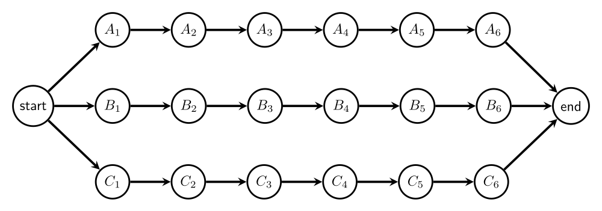
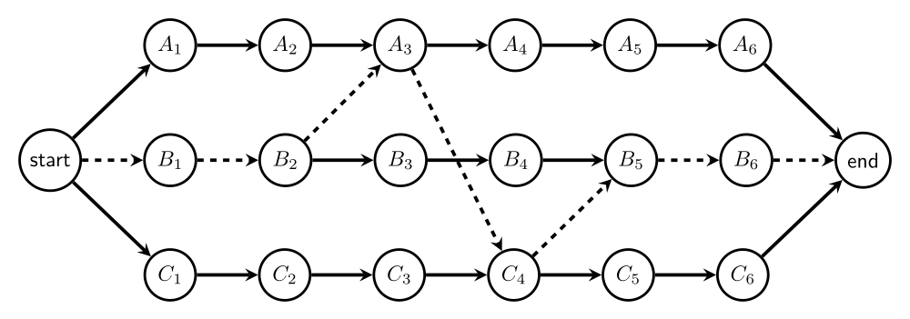

### Introduction

Now that the TAs have worked out an office hours schedule to their satisfaction, they want to optimize how exams are graded.  Previously a lot of dice and a magic 8-ball were used.  The TAs have a new idea in mind, and your job is to write a program to help schedule that new grading idea.

### Changelog

Any changes to this page will be put here for easy reference.  Typo fixes and minor clarifications are not listed here.  So far there aren't any significant changes to report.

### Overview

The TAs want to form a number of "teams" to grade the exams, with each of the TAs on a given team grading a different question.  As there are more TAs than questions on any given exam, there will be multiple TAs on a given question, but exactly one TA per question on each team.  Each exam has to pass through each of the questions, in order, before it is fully graded.  However, any given exam can switch between the teams.  We'll assume, for all input cases, that the number of TAs is an integer multiple, greater than 0, of the number of questions on the exam.

For example, let us assume that there are 18 TAs and 6 exam questions.  Three TAs will grade each question.  We can put them into three teams so that one TA for each question is team "A", one of each is team "B", and one of each is team "C".  (We'll use numbers starting from 0 in our input below, but using letters for teams will make it easier to walk through this example.) This would look like the following:



When any of the question 1 graders ($A_1$, $B_1$, or $C_1$) becomes available, they will take the next exam, and it will proceed through the questions, in order through the team, until it is graded.  (We are assuming it must be in order since sometimes answers are dependent on previous answers).

However, this is not optimal.  When an exam is moving through the diagram, and waiting for its next question to be graded, a grader from a different team might be faster.  For example, an exam could take a faster path by switching through the teams, as shown by the dashed lines:



There are a number of other factors to consider:

- Different TAs take different amounts of time to grade a question.  We'll assume that all of a given question are equivalently hard to grade (meaning one student's answer for question 3 is just as hard to grade as another student's answer for question 3), but that different TAs have different grading speeds.  We'll define $g(t,q)$, which is how much time it takes for the TA on team $t$ to grade question $q$. (Mnemonic: 'g' is for grading time)
- Transfer time.  The TAs are optimized into teams, so passing an exam from one TA to the next on the same team takes 0 time.  However, passing it to a TA on a *different* team takes $x(t,q)$ time to pass the question from TA on team $t$ to a TA on another team (any of the other teams) grading question $q$. (Mnemonic: 'x' is for xfer (transfer) time)

We are looking for the fastest time to grade the exam.

The problem, then is to determine the fastest time to grade a *single* exam.  To make this problem viable, we will assume that all the TAs are idle, and any TA is available to grade their respective question at any time.

### Algorithm Example

We will continue the example from the diagrams above, with 18 TAs and 6 exam questions.  Thus, there are 3 teams.

Each problem will be given the number of teams, the number of TAs, and the values in both $g(t,q)$ (the time it takes for the TA on team $t$ to grade question $q$) and $x(t,q)$ (the transfer time to transfer a question from team $t$ to any other team who is grading question $q$).

Let $f(t,q)$ be the fastest time that team $t$ could have graded question $q$.

For example, consider determining the fastest time that team B could have graded question 3.  There are three possibilities:

1. Question 2 was graded by team A.  We have to take into account transfer time here, so the total time is $f(A,2)+g(B,3)+x(A,3)$: the fastest time when question 2 was graded by team A ($f(A,2)$) plus the time it took for team B to grade question 3 ($g(B,3)$), plus the time it took to transfer the question from team A to another team (here,  B) who is grading question 3 ($x(A,3)$).
2. Question 2 was graded by team B.  There is no transfer time, so the total time is $f(B,2)+g(B,3)$: the fastest time when question 2 was graded by team B ($f(B,2)$) plus the time it took for the TA on team B to grade question 3 ($g(B,3)$).
3. Question 3 was graded by team C.  This is similar to the first case, but replace team A with team C.  The total time here is $f(C,2)+g(B,3)+x(C,3)$

The final result for $f(B,3)$ is the minimum of those three values.

Note that there could be more than three teams.  Also, the teams are represented by numbers (starting from 0), but it's easier to explain using letters for teams.  In the above example, A=0, B=1, and C=2.

The final answer is the minimum of the times to have graded the last question.  In this example, that is the minimum of $f(A,6)$, $f(B,6)$, and $f(C,6)$.

### Specific Example

Let's assume we still have 18 TAs and 6 exam questions.  Note that this example does NOT correspond to the diagrams above.

The cost for the teams to grade each question is as follows (this is the $g$ array).

| Team | Q1 | Q2 | Q3 | Q4 | Q5 | Q6 |
|------|----|----|----|----|----|----|
| A |  7 | 11 |  6 | 11 |  9 |  7 |
| B |  9 | 15 | 12 | 15 | 11 | 14 | 
| C | 14 |  5 | 11 | 12 |  5 |  6 |

The cost to transfer an exam from one team to another is as follows (this is the $x$ array).  Note that there is no transfer to question 1.

| Team | to Q2 | to Q3 | to Q4 | to Q5 | to Q6 |
|------|----|----|----|----|----|
| A | 6 | 7 | 5 | 6 | 5 |
| B | 8 | 8 | 7 | 6 | 7 | 
| C | 9 | 8 | 9 | 7 | 7 |

The cost to grade question 1 by each of the teams is just the cost to grade that question, as there is no transferring at that point, so it is 7, 8, and 14, respectively, for teams A, B, and C.

Consider the cost for question 2 to be graded by team C.  Possibilities:

- It could have come from team A.  Then the cost is 7 (the cost for team A to have graded question 1), plus 6 (the cost for team A to transfer the exam to *any* team grading question 2), plus 5 (the cost for team C to grade question 2), for a total of 18.
- It could have come from team B.  Then the cost is 9 (the cost for team B to have graded question 1), plus 8 (the cost for team B to transfer the exam to *any* team grading question 2), plus 5 (the cost for team C to grade question 2), for a total of 22.
- It could have come from team C.  Then the cost is 14 (the cost for team C to have graded question 1), plus 5 (the cost for team C to grade question 2), for a total cost of 19; there is no transfer time when the next question is being graded by the same team.

The minimum of these is 18, which is the least amount of time taken when team C has graded question 2.  This means that, for team C to have graded question 2, the fastest path was for team A to have graded question 1 and then the test was transferred to team C to grade question 2.

### Input

**For this homework, we are *NOT* providing you with skeleton code that handles reading in of the input.**  You should look at the previous two homeworks for examples how to do so: [PA1: Driving Directions](../pa1/index.html) ([md](../pa1/index.md)) and [PA2: Office Hours](../pa2/index.html) ([md](../pa2/index.md)).


All input is read in from standard input (not a file).  All values read in are non-negative integers that will fit into a signed `int` variable.

The first line of the file will contain the single positive integer $1 \le c \le 10^5$, the number of test cases in the file.

The first line of each test case will contain two values $n$ and $q$, space separated, which is the number of TAs and exam questions, respectively.  It will always be the case that $n$ is a positive integer multiple of $q$.  The number of grading teams, then, would be $n/q$.

The next line will contain the time taken to grade array (array $g$ in the description above).  This will be presented as a single line of space-separated values in row-major order (the first row (the time for the "A" team to grade), followed by the second row (the time for the "B" team to grade), followed by the third row, etc.).

The next line will contain the transfer time array (array $x$ in the description above).  This will be presented as a single line of space-separated values in row-major order.  Note that this array has one fewer columns than the $g$ array.


### Sample Input

The first test case is the specific example shown above.
This file is available as [example.in](example.in).


```
3
18 6
7 11 6 11 9 7 9 15 12 15 11 14 14 5 11 12 5 6
6 7 5 6 5 8 8 7 6 7 9 8 9 7 7
25 5
8 10 8 6 12 8 9 15 7 11 15 6 7 15 8 9 6 12 11 13 11 6 13 10 10
8 7 6 9 7 8 5 10 9 7 8 5 9 7 8 7 10 7 9 8
48 12
12 11 14 11 5 13 14 14 11 8 15 9 11 6 11 11 11 8 13 7 7 13 13 6 7 12 8 10 7 13 10 12 9 13 5 7 8 9 7 6 8 6 14 5 11 7 6 7
10 6 10 6 10 10 9 5 6 10 10 9 8 8 10 9 5 9 7 6 10 9 9 7 7 6 7 6 7 10 6 7 9 9 10 6 6 8 10 6 8 10 8 10
```

Other, larger, test cases are described below.

### Output

Each test case will output a single integer, which is the minimum cost to grade that exam.

### Sample Output

```
51
44
94
```

### Notes

This assignment must be a *dynamic programming solution*.  We have some very large test cases, and they will time out with any other type of solution.  Some of those test cases are given below.

There are some assumptions that you may and may not make:

- All values, both input and output, are non-negative integer values that will fit into a signed `int` variable
- The input provided will always be valid
- There will be at least 2 teams, and at least 4 TAs
- The number of TAs will always be a positive integer multiple of the number of questions on the exam


There a few large test cases available in Canvas' Files.  They are contained in a zip file named `pa4-examples.zip`.  The files therein are as follows.  

We give the times so you can see, relatively, how long they might take -- obviously the speed on your computer will vary.  These were using a Python solution, and Java tends to be faster than Python (*everything* is faster than Python).  It's fine if your program is slower, as long as the second-to-last test case below (`pa4-example-1M-1k.in`) runs in a minute or less.

- `pa4-example-1k-10.in`: 1,000 TAs and 10 questions, which means 100 teams; the answer is 64, and it took about 0.05 seconds to compute.
- `pa4-example-10k-100.in`: 10,000 TAs and 100 questions, which means 100 teams; the answer is 739, and it took about 0.1 seconds to compute.
- `pa4-example-100k-1k.in`: 100,000 TAs and 1,000 questions, which means 100 teams; the answer is 7362, and it took about 1 second to compute.
- `pa4-example-1M-10k.in`: 1 million TAs and 10,000 questions, which means 100 teams; the answer is 73511, and it took about 8 seconds to compute.
- `pa4-example-1M-1k.in`: 1 million TAs and 1,000 questions, which means 1,000 teams; the answer is 6754, and it took about 80 seconds to compute.
	- We aren't going to test a test case of this size on Gradescope!

If your program does not implement a dynamic programming algorithm, at least one of those cases will time out when we run it (not counting the last one).

### Execution

We will run your program as follows:

```
cat example.in | python3 pa4.py
```

or:

```
cat example.in | java PA4
```

This takes the output of what is on the left (`cat example.in`, whose output is the contents of the example.in file) and uses it as the input to what is on the right.  This version should work in all platforms (Windows, MacOS, and Linux).

### Submission

You will submit your completed `pa4.py` or `PA4.java` file to Gradescope.  There will be a *small set* of acceptance tests that are *NOT COMPREHENSIVE*.  These acceptance tests are the test cases in [example.in](example.in) file.  It's up to you to comprehensively test your code.  The acceptance tests just verify that you are reading the input correctly and providing the expected output.
